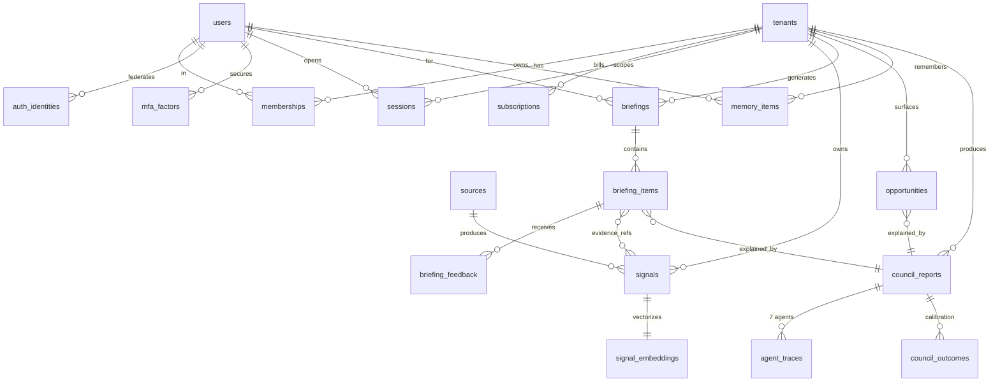
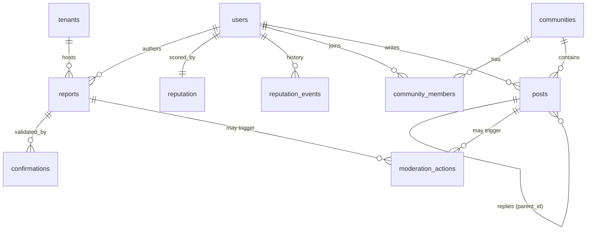
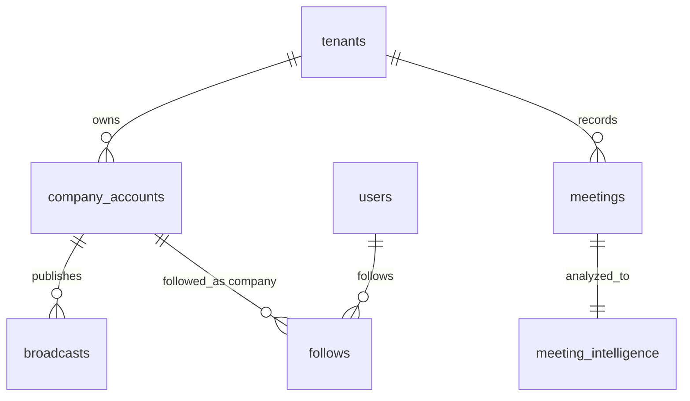
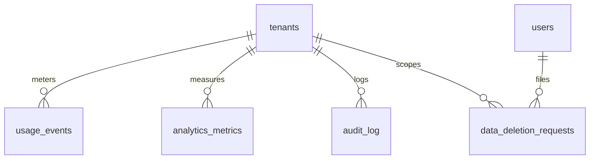

# Phase 2.2 — ER Diagrams & Relationships

Rendered with Mermaid (GitHub-native). Split by bounded context to stay legible.

## Core: Identity, Tenancy & Intelligence

## Network: Community, Reputation, Communities

## Enterprise: Corporate Rooms & Meetings

## Ops & Compliance

## Relationship rules (referential integrity & cascade policy)
| Parent | Child | On delete | Reason |
|---|---|---|---|
| tenants | (all tenant-scoped) | CASCADE | tenant offboarding / hard-delete |
| users | memberships, sessions, mfa_factors, auth_identities | CASCADE | account deletion |
| users | memory_items, briefings, reports | CASCADE (then crypto-shred) | GDPR erasure |
| briefings | briefing_items | CASCADE | composition |
| council_reports | agent_traces, council_outcomes | CASCADE | composition |
| communities | posts, community_members | CASCADE | composition |
| meetings | meeting_intelligence | CASCADE | composition |
| audit_log | — | RESTRICT (never cascade) | tamper-evidence; retained per compliance |

**Note:** `audit_log` and `data_deletion_requests` are intentionally NOT cascade-deleted when a user is erased — they retain a minimized, lawful record of the erasure itself (legal basis: compliance obligation). PII within them is tokenized/redacted, not the event.

## Polymorphic references
`moderation_actions.target_id`, `council_reports.subject_id`, `usage_events`, `reputation_events.ref_id` use `(type, id)` pairs rather than FKs (polymorphic). Integrity enforced at the service layer + periodic reconciliation jobs, not DB FKs — a deliberate trade-off for flexibility documented here so it isn't mistaken for a missing constraint.
